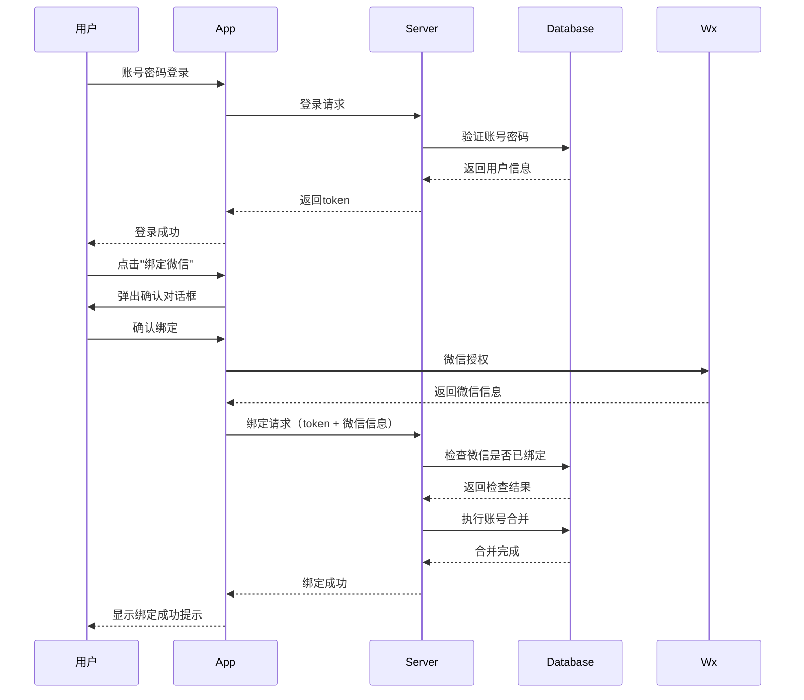
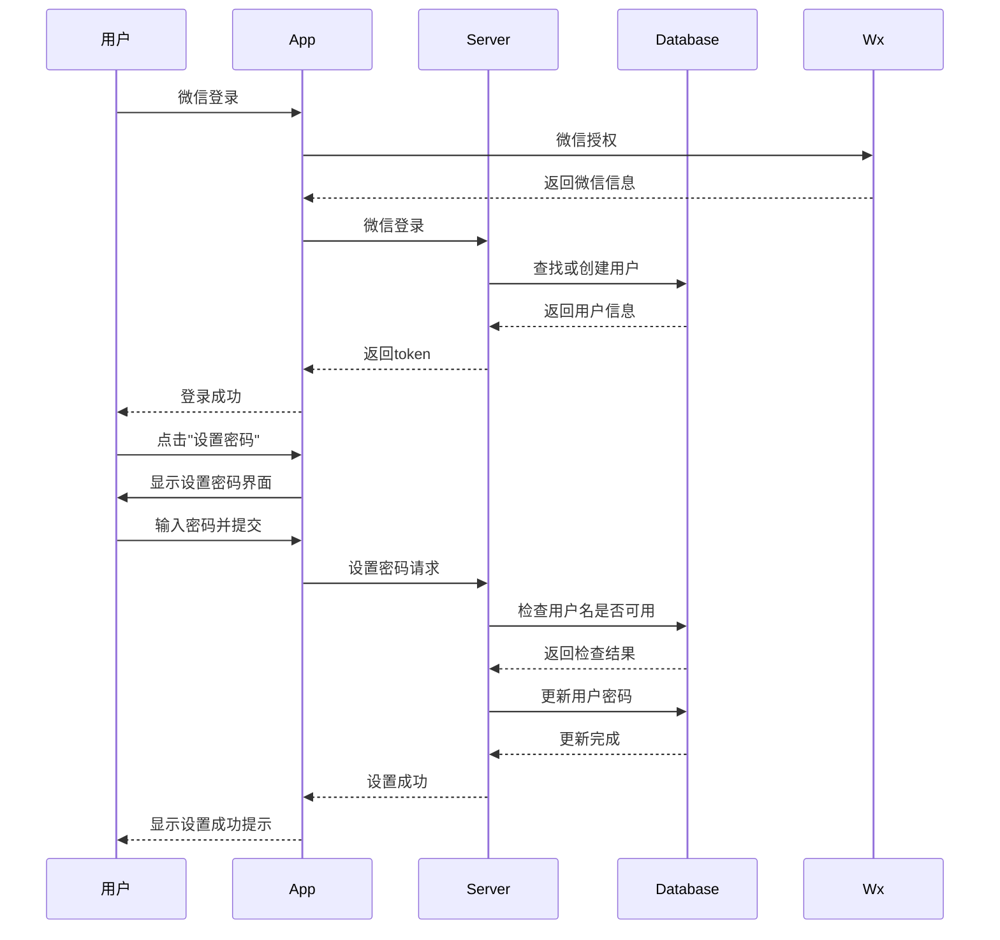

# uni-id 账号绑定与合并系统设计

## 一、需求概述

### 1.1 问题现状
- 用户可以通过账号密码注册/登录
- 用户可以通过微信授权注册/登录
- 两种方式会创建两个独立的账号
- 用户数据分散在两个账号中
- 缺乏账号关联和合并机制

### 1.2 业务需求
- **账号绑定**：支持将已有账号密码账号绑定到微信账号
- **数据合并**：合并两个账号的历史使用数据
- **权限控制**：仅在特定条件下允许合并
- **添加密码**：微信登录用户可以设置账号密码

## 二、账号绑定逻辑

### 2.1 绑定规则

#### 支持绑定的场景
```
账号密码登录 → 绑定微信号
├── 条件1：账号密码已存在
├── 条件2：当前未绑定微信
├── 条件3：微信号未被其他账号绑定
└── 结果：账号合并，数据合并
```

#### 不支持绑定的场景
```
微信登录 → 绑定已有账号密码账号
└── 结果：不允许，防止账号冒用
```

#### 支持添加密码的场景
```
微信登录 → 添加新的账号密码
├── 条件：当前只有微信登录方式
└── 结果：为微信账号添加密码登录方式
```

### 2.2 业务流程

#### 账号绑定流程（账号密码 → 微信）


#### 添加密码流程（微信登录 → 添加密码）


## 三、数据库设计

### 3.1 用户表结构扩展（uni-id-users）

```javascript
// uni-id-users 表扩展字段
{
  "_id": "ObjectId",
  "username": "string",           // 用户名（可选）
  "password": "string",           // 密码（可选）
  "nickname": "string",          // 昵称
  "wx_unionid": "string",        // 微信unionid
  "wx_openid": "string",         // 微信openid
  "mobile": "string",            // 手机号
  "email": "string",             // 邮箱
  "status": 0,                   // 用户状态：0正常 1禁用
  "register_type": "password",   // 注册类型：password/wechat
  "bound_accounts": [           // 绑定的账号列表
    {
      "type": "password",       // 账号类型
      "username": "user123",     // 用户名
      "bound_time": "timestamp" // 绑定时间
    },
    {
      "type": "wechat",
      "nickname": "微信昵称",
      "openid": "wx_openid",
      "unionid": "wx_unionid",
      "bound_time": "timestamp"
    }
  ],
  "merge_history": [            // 合并历史记录
    {
      "from_user_id": "ObjectId", // 被合并的用户ID
      "merge_time": "timestamp",  // 合并时间
      "merge_type": "password_to_wechat" // 合并类型
    }
  ],
  // 其他现有字段...
}
```

### 3.2 账号合并记录表（user_merge_logs）

```javascript
// user_merge_logs 表结构
{
  "_id": "ObjectId",
  "main_user_id": "ObjectId",      // 主账号ID
  "merged_user_id": "ObjectId",    // 被合并账号ID
  "merge_type": "string",         // 合并类型
  "merge_data": {                 // 合并的数据详情
    "orders_merged": 5,            // 合并的订单数
    "reservations_merged": 3,      // 合并的预约数
    "vip_records_merged": 1       // 合并的VIP记录数
  },
  "merge_time": "timestamp",      // 合并时间
  "operator_id": "string"         // 操作人ID
}
```

## 四、API接口设计

### 4.1 账号绑定相关接口

#### 4.1.1 检查是否可以绑定
```javascript
// POST /api/user/check-can-bind
{
  "bind_type": "wechat"  // 绑定类型：wechat/password
}
```

#### 4.1.2 绑定微信账号
```javascript
// POST /api/user/bind-wechat
{
  "wx_code": "string",     // 微信授权码
  "confirm_merge": true     // 确认合并数据
}
```

#### 4.1.3 设置账号密码
```javascript
// POST /api/user/set-password
{
  "username": "string",     // 用户名（可选）
  "password": "string",     // 密码
  "confirm_password": "string"  // 确认密码
}
```

### 4.2 账号查询相关接口

#### 4.2.1 获取账号绑定状态
```javascript
// GET /api/user/bind-status
// 返回用户当前的绑定状态
```

#### 4.2.2 查询可合并的账号
```javascript
// POST /api/user/find-mergeable-accounts
{
  "mobile": "string",       // 手机号（可选）
  "email": "string"         // 邮箱（可选）
}
```

## 五、云函数实现

### 5.1 账号绑定服务

```javascript
// uniCloud-aliyun/cloudfunctions/todo/services/accountBindService.js

const db = uniCloud.database()
const userCollection = db.collection('uni-id-users')
const mergeLogCollection = db.collection('user_merge_logs')

class AccountBindService {

  /**
   * 检查是否可以绑定微信
   */
  async checkCanBindWechat(userId) {
    const user = await userCollection.doc(userId).get()

    // 检查是否已绑定微信
    if (user.data[0].wx_openid) {
      return {
        code: 1,
        message: '该账号已绑定微信'
      }
    }

    return {
      code: 0,
      message: '可以绑定微信'
    }
  }

  /**
   * 绑定微信账号
   */
  async bindWechat(userId, wxCode) {
    // 1. 获取微信用户信息
    const wxUserInfo = await this.getWxUserInfo(wxCode)

    // 2. 检查微信是否已被其他账号绑定
    const existingUser = await userCollection
      .where({
        wx_openid: wxUserInfo.openid
      })
      .get()

    if (existingUser.data.length > 0) {
      return {
        code: 1,
        message: '该微信已被其他账号绑定'
      }
    }

    // 3. 执行账号合并
    return await this.mergeAccounts(userId, wxUserInfo)
  }

  /**
   * 账号合并
   */
  async mergeAccounts(mainUserId, wxUserInfo) {
    const transaction = await db.startTransaction()

    try {
      // 1. 查找是否有使用该微信注册的独立账号
      const wechatUser = await userCollection
        .where({
          wx_openid: wxUserInfo.openid
        })
        .get()

      let mergeData = {
        orders_merged: 0,
        reservations_merged: 0,
        vip_records_merged: 0
      }

      // 2. 如果存在独立的微信账号，执行数据合并
      if (wechatUser.data.length > 0) {
        const wechatUserId = wechatUser.data[0]._id

        // 合并订单数据
        mergeData.orders_merged = await this.mergeOrders(mainUserId, wechatUserId)

        // 合并预约数据
        mergeData.reservations_merged = await this.mergeReservations(mainUserId, wechatUserId)

        // 合并VIP记录
        mergeData.vip_records_merged = await this.mergeVipRecords(mainUserId, wechatUserId)

        // 记录合并历史
        await mergeLogCollection.add({
          main_user_id: mainUserId,
          merged_user_id: wechatUserId,
          merge_type: 'wechat_to_password',
          merge_data: mergeData,
          merge_time: Date.now(),
          operator_id: mainUserId
        })

        // 标记被合并账号为已合并
        await userCollection.doc(wechatUserId).update({
          status: -1,  // 标记为已合并
          merged_into: mainUserId,
          merge_time: Date.now()
        })
      }

      // 3. 更新主账号的微信信息
      await userCollection.doc(mainUserId).update({
        wx_openid: wxUserInfo.openid,
        wx_unionid: wxUserInfo.unionid,
        wx_nickname: wxUserInfo.nickname,
        'bound_accounts': db.command.push({
          type: 'wechat',
          nickname: wxUserInfo.nickname,
          openid: wxUserInfo.openid,
          unionid: wxUserInfo.unionid,
          bound_time: Date.now()
        }),
        'merge_history': db.command.push({
          from_user_id: wechatUser.data[0]?._id,
          merge_time: Date.now(),
          merge_type: 'password_to_wechat'
        })
      })

      await transaction.commit()

      return {
        code: 0,
        message: '绑定成功',
        data: mergeData
      }

    } catch (error) {
      await transaction.rollback()
      throw error
    }
  }

  /**
   * 合并订单数据
   */
  async mergeOrders(mainUserId, mergedUserId) {
    const ordersCollection = db.collection('fishcave-orders')
    const vipOrdersCollection = db.collection('fishcave-viporders')

    // 合并普通订单
    const orders = await ordersCollection
      .where({ user_id: mergedUserId })
      .get()

    for (const order of orders.data) {
      await ordersCollection.doc(order._id).update({
        user_id: mainUserId,
        merged_from: mergedUserId
      })
    }

    // 合并VIP订单
    const vipOrders = await vipOrdersCollection
      .where({ user_id: mergedUserId })
      .get()

    for (const order of vipOrders.data) {
      await vipOrdersCollection.doc(order._id).update({
        user_id: mainUserId,
        merged_from: mergedUserId
      })
    }

    return orders.data.length + vipOrders.data.length
  }

  /**
   * 合并预约数据
   */
  async mergeReservations(mainUserId, mergedUserId) {
    const reservationsCollection = db.collection('fishcave-reservations')

    const reservations = await reservationsCollection
      .where({ user_id: mergedUserId })
      .get()

    for (const reservation of reservations.data) {
      await reservationsCollection.doc(reservation._id).update({
        user_id: mainUserId,
        merged_from: mergedUserId
      })
    }

    return reservations.data.length
  }

  /**
   * 合并VIP记录
   */
  async mergeVipRecords(mainUserId, mergedUserId) {
    const membershipCollection = db.collection('membership')

    const membership = await membershipCollection
      .where({ user_id: mergedUserId })
      .get()

    for (const record of membership.data) {
      await membershipCollection.doc(record._id).update({
        user_id: mainUserId,
        merged_from: mergedUserId
      })
    }

    return membership.data.length
  }

  /**
   * 设置账号密码
   */
  async setPassword(userId, username, password) {
    const user = await userCollection.doc(userId).get()

    // 检查是否已设置密码
    if (user.data[0].password) {
      return {
        code: 1,
        message: '该账号已设置密码'
      }
    }

    // 检查用户名是否已被使用
    if (username) {
      const existingUser = await userCollection
        .where({
          username: username,
          _id: db.command.neq(userId)
        })
        .get()

      if (existingUser.data.length > 0) {
        return {
          code: 1,
          message: '用户名已被使用'
        }
      }
    }

    // 更新用户密码
    const passwordHash = await this.hashPassword(password)

    await userCollection.doc(userId).update({
      username: username,
      password: passwordHash,
      'bound_accounts': db.command.push({
        type: 'password',
        username: username,
        bound_time: Date.now()
      })
    })

    return {
      code: 0,
      message: '密码设置成功'
    }
  }

  /**
   * 获取账号绑定状态
   */
  async getBindStatus(userId) {
    const user = await userCollection.doc(userId).get()
    const userData = user.data[0]

    return {
      code: 0,
      data: {
        has_password: !!userData.password,
        has_wechat: !!userData.wx_openid,
        bound_accounts: userData.bound_accounts || [],
        can_bind_wechat: !userData.wx_openid,
        can_set_password: !userData.password
      }
    }
  }
}

module.exports = new AccountBindService()
```

## 六、前端界面设计

### 6.1 账号绑定页面

```vue
<!-- pages/account/bind.vue -->
<template>
  <view class="account-bind">
    <view class="bind-status">
      <view class="status-item" v-if="hasPassword">
        <text class="icon">🔐</text>
        <text class="label">账号密码</text>
        <text class="status">已绑定</text>
      </view>
      <view class="status-item" v-if="hasWechat">
        <text class="icon">📱</text>
        <text class="label">微信</text>
        <text class="status">已绑定</text>
      </view>
    </view>

    <view class="bind-actions">
      <!-- 绑定微信按钮（仅在账号密码登录时显示） -->
      <button
        v-if="hasPassword && !hasWechat && canBindWechat"
        @click="handleBindWechat"
        class="bind-btn wechat-btn"
      >
        绑定微信账号
      </button>

      <!-- 设置密码按钮（仅在微信登录时显示） -->
      <button
        v-if="hasWechat && !hasPassword && canSetPassword"
        @click="showSetPasswordModal"
        class="bind-btn password-btn"
      >
        设置账号密码
      </button>
    </view>

    <!-- 绑定确认弹窗 -->
    <uni-popup ref="bindConfirmPopup" type="dialog">
      <uni-popup-dialog
        title="确认绑定"
        content="绑定微信账号后，两个账号的数据将会合并，确定继续吗？"
        @confirm="confirmBindWechat"
        @close="cancelBindWechat"
      />
    </uni-popup>

    <!-- 设置密码弹窗 -->
    <uni-popup ref="setPasswordPopup" type="bottom">
      <view class="set-password-modal">
        <view class="modal-header">
          <text class="title">设置账号密码</text>
          <text class="close" @click="closeSetPasswordModal">×</text>
        </view>

        <view class="modal-content">
          <uni-forms ref="passwordForm" :model="passwordForm">
            <uni-forms-item label="用户名（可选）">
              <uni-easyinput
                v-model="passwordForm.username"
                placeholder="请输入用户名"
              />
            </uni-forms-item>

            <uni-forms-item label="密码">
              <uni-easyinput
                v-model="passwordForm.password"
                type="password"
                placeholder="请输入密码"
              />
            </uni-forms-item>

            <uni-forms-item label="确认密码">
              <uni-easyinput
                v-model="passwordForm.confirmPassword"
                type="password"
                placeholder="请再次输入密码"
              />
            </uni-forms-item>
          </uni-forms>
        </view>

        <view class="modal-footer">
          <button @click="cancelSetPassword" class="cancel-btn">取消</button>
          <button @click="confirmSetPassword" class="confirm-btn">确认</button>
        </view>
      </view>
    </uni-popup>

    <!-- 合并结果弹窗 -->
    <uni-popup ref="mergeResultPopup" type="dialog">
      <uni-popup-dialog
        title="绑定成功"
        :content="mergeResultContent"
        @confirm="closeMergeResult"
        :show-close="false"
      />
    </uni-popup>
  </view>
</template>

<script>
export default {
  data() {
    return {
      hasPassword: false,
      hasWechat: false,
      canBindWechat: false,
      canSetPassword: false,
      wxCode: '',
      passwordForm: {
        username: '',
        password: '',
        confirmPassword: ''
      },
      mergeResultContent: ''
    }
  },

  onLoad() {
    this.loadBindStatus()
  },

  methods: {
    async loadBindStatus() {
      const res = await uniCloud.importObject('todo').getBindStatus()
      if (res.code === 0) {
        this.hasPassword = res.data.has_password
        this.hasWechat = res.data.has_wechat
        this.canBindWechat = res.data.can_bind_wechat
        this.canSetPassword = res.data.can_set_password
      }
    },

    async handleBindWechat() {
      // 先检查是否可以绑定
      const checkRes = await uniCloud.importObject('todo').checkCanBindWechat()
      if (checkRes.code !== 0) {
        uni.showToast({
          title: checkRes.message,
          icon: 'none'
        })
        return
      }

      // 显示确认弹窗
      this.$refs.bindConfirmPopup.open()
    },

    async confirmBindWechat() {
      try {
        // 获取微信授权码
        const wxRes = await this.getWxAuthorization()

        // 执行绑定
        const bindRes = await uniCloud.importObject('todo').bindWechat(wxRes.code)

        if (bindRes.code === 0) {
          // 显示合并结果
          const { orders_merged, reservations_merged, vip_records_merged } = bindRes.data
          this.mergeResultContent = `绑定成功！\n合并了 ${orders_merged} 个订单\n合并了 ${reservations_merged} 个预约记录\n合并了 ${vip_records_merged} 个VIP记录`

          this.$refs.mergeResultPopup.open()
          this.loadBindStatus()
        } else {
          uni.showToast({
            title: bindRes.message,
            icon: 'none'
          })
        }
      } catch (error) {
        uni.showToast({
          title: '绑定失败，请重试',
          icon: 'none'
        })
      }
    },

    getWxAuthorization() {
      return new Promise((resolve, reject) => {
        uni.login({
          provider: 'weixin',
          success: resolve,
          fail: reject
        })
      })
    },

    showSetPasswordModal() {
      this.$refs.setPasswordPopup.open()
    },

    closeSetPasswordModal() {
      this.$refs.setPasswordPopup.close()
      this.passwordForm = {
        username: '',
        password: '',
        confirmPassword: ''
      }
    },

    async confirmSetPassword() {
      if (this.passwordForm.password !== this.passwordForm.confirmPassword) {
        uni.showToast({
          title: '两次密码输入不一致',
          icon: 'none'
        })
        return
      }

      const res = await uniCloud.importObject('todo').setPassword(
        this.passwordForm.username,
        this.passwordForm.password
      )

      if (res.code === 0) {
        uni.showToast({
          title: '密码设置成功',
          icon: 'success'
        })
        this.closeSetPasswordModal()
        this.loadBindStatus()
      } else {
        uni.showToast({
          title: res.message,
          icon: 'none'
        })
      }
    },

    cancelSetPassword() {
      this.closeSetPasswordModal()
    },

    closeMergeResult() {
      this.$refs.mergeResultPopup.close()
    }
  }
}
</script>

<style lang="scss">
.account-bind {
  padding: 30rpx;

  .bind-status {
    background: #fff;
    border-radius: 16rpx;
    padding: 30rpx;
    margin-bottom: 30rpx;

    .status-item {
      display: flex;
      align-items: center;
      padding: 20rpx 0;

      .icon {
        font-size: 40rpx;
        margin-right: 20rpx;
      }

      .label {
        flex: 1;
        font-size: 28rpx;
        color: #333;
      }

      .status {
        font-size: 24rpx;
        color: #67c23a;
      }
    }
  }

  .bind-actions {
    .bind-btn {
      width: 100%;
      height: 88rpx;
      border-radius: 44rpx;
      font-size: 28rpx;
      margin-bottom: 20rpx;

      &.wechat-btn {
        background: #07c160;
        color: white;
      }

      &.password-btn {
        background: #409eff;
        color: white;
      }
    }
  }
}

.set-password-modal {
  background: white;
  border-radius: 16rpx 16rpx 0 0;
  padding: 30rpx;

  .modal-header {
    display: flex;
    justify-content: space-between;
    align-items: center;
    margin-bottom: 30rpx;

    .title {
      font-size: 32rpx;
      font-weight: bold;
      color: #333;
    }

    .close {
      font-size: 40rpx;
      color: #999;
    }
  }

  .modal-footer {
    display: flex;
    justify-content: flex-end;
    gap: 20rpx;
    margin-top: 30rpx;

    button {
      width: 120rpx;
      height: 60rpx;
      border-radius: 30rpx;
      font-size: 24rpx;

      &.cancel-btn {
        background: #f5f5f5;
        color: #666;
      }

      &.confirm-btn {
        background: #409eff;
        color: white;
      }
    }
  }
}
</style>
```

## 七、数据合并策略

### 7.1 订单数据合并

**合并规则**：
- 保留所有订单记录
- 更新订单的user_id为主账号ID
- 记录原始账号ID到merged_from字段

**合并逻辑**：
```javascript
// 合并订单时，更新用户ID并保留原始信息
{
  user_id: mainUserId,           // 更新为主账号ID
  merged_from: mergedUserId,     // 记录来源账号
  merge_time: timestamp           // 合并时间
}
```

### 7.2 VIP记录合并

**合并规则**：
- 保留所有VIP记录
- 合并相同类型的VIP时长
- 按到期时间排序处理冲突

**合并逻辑**：
```javascript
// VIP记录合并策略
1. 保留所有有效的VIP记录
2. 如果有重叠的有效期，则向后顺延
3. 保留最长的会员等级
```

### 7.3 预约记录合并

**合并规则**：
- 保留所有历史预约记录
- 更新预约的用户ID
- 保留原有的状态和时间信息

## 八、权限控制

### 8.1 绑定权限检查

```javascript
// 前端权限检查
function checkBindPermission() {
  const currentUser = getCurrentUser()

  // 只有通过账号密码登录的用户可以绑定微信
  if (currentUser.login_type === 'password' && !currentUser.wx_openid) {
    return { can_bind_wechat: true }
  }

  // 微信登录用户不能绑定已有账号，但可以设置密码
  if (currentUser.login_type === 'wechat' && !currentUser.password) {
    return { can_set_password: true, can_bind_account: false }
  }

  return { can_bind_wechat: false, can_set_password: false }
}
```

### 8.2 后端权限验证

```javascript
// 云函数权限验证
async function validateBindPermission(userId, bindType) {
  const user = await userCollection.doc(userId).get()
  const userData = user.data[0]

  if (bindType === 'wechat') {
    // 检查是否已绑定微信
    if (userData.wx_openid) {
      throw new Error('已绑定微信，无法重复绑定')
    }

    // 检查是否是通过账号密码登录的
    if (!userData.password) {
      throw new Error('只有账号密码登录用户可以绑定微信')
    }
  }

  if (bindType === 'password') {
    // 检查是否已设置密码
    if (userData.password) {
      throw new Error('已设置密码，无法重复设置')
    }

    // 检查是否是通过微信登录的
    if (!userData.wx_openid) {
      throw new Error('只有微信登录用户可以设置密码')
    }
  }
}
```

## 九、异常处理

### 9.1 网络异常处理

```javascript
// 绑定过程中的异常处理
async function safeBindWechat(userId, wxCode) {
  try {
    // 开启事务
    const transaction = await db.startTransaction()

    // 执行绑定逻辑
    const result = await bindWechatInTransaction(userId, wxCode, transaction)

    // 提交事务
    await transaction.commit()

    return result
  } catch (error) {
    // 回滚事务
    await transaction.rollback()

    // 记录错误日志
    await logBindError(userId, error)

    throw error
  }
}
```

### 9.2 数据冲突处理

```javascript
// 处理微信绑定冲突的情况
async function handleWxBindConflict(wxUserInfo) {
  // 查找使用该微信注册的账号
  const wechatUser = await userCollection
    .where({ wx_openid: wxUserInfo.openid })
    .get()

  if (wechatUser.data.length === 0) {
    return null  // 无冲突
  }

  const existingUser = wechatUser.data[0]

  // 检查该账号是否已绑定其他登录方式
  if (existingUser.password) {
    throw new Error('该微信已绑定其他账号')
  }

  // 纯微信账号，可以合并
  return existingUser
}
```

## 十、安全考虑

### 10.1 数据安全

1. **敏感信息保护**：
   - 密码加密存储
   - 手机号、邮箱脱敏显示
   - 用户隐私数据保护

2. **数据完整性**：
   - 使用数据库事务确保数据一致性
   - 合并操作留痕，便于追溯
   - 定期备份重要数据

### 10.2 防止账号冒用

1. **绑定验证**：
   - 绑定微信时需要确认操作
   - 重要操作需要重新验证身份
   - 绑定操作记录日志

2. **权限控制**：
   - 严格按场景控制绑定权限
   - 防止恶意账号合并
   - 异常行为监控

### 10.3 合并安全

1. **合并确认**：
   - 数据合并前需要用户确认
   - 显示合并的具体数据
   - 提供合并结果的反馈

2. **数据恢复**：
   - 保留被合并账号的原始数据
   - 支持人工干预恢复数据
   - 记录完整的合并历史

## 十一、测试计划

### 11.1 功能测试

1. **账号绑定测试**：
   - 账号密码 → 绑定微信
   - 微信登录 → 设置密码
   - 各种异常场景测试

2. **数据合并测试**：
   - 订单数据合并
   - VIP记录合并
   - 预约记录合并

### 11.2 性能测试

1. **并发绑定测试**：
   - 多用户同时绑定
   - 数据合并性能
   - 数据库压力测试

### 11.3 安全测试

1. **权限测试**：
   - 绕过权限验证
   - 恶意账号合并
   - 数据泄露测试

## 十二、部署计划

### 12.1 数据库升级

1. **表结构更新**：
   - 更新uni-id-users表结构
   - 创建user_merge_logs表
   - 数据迁移脚本

2. **索引优化**：
   - 为查询字段添加索引
   - 优化合并操作性能

### 12.2 功能发布

1. **灰度发布**：
   - 部分用户开放功能
   - 收集用户反馈
   - 问题修复和优化

2. **全量发布**：
   - 全部用户开放功能
   - 监控系统运行
   - 持续性能优化

---

*本设计方案为uni-id账号绑定与合并系统的完整规划，具体实现时可根据业务需求进行调整。*