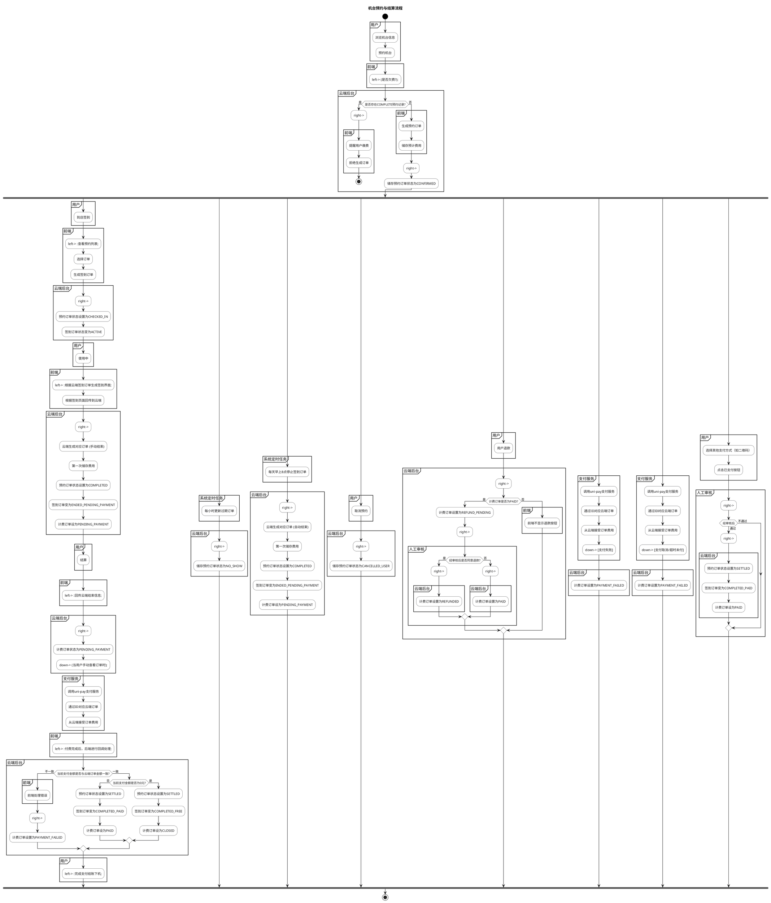

# YuwoApp 统计功能文档

## 概述

YuwoApp 的统计功能提供了对音乐游戏场馆预约数据的全面分析，包括预约统计、收入分析、机台使用情况等多个维度的数据展示。

## 功能架构

### 前端组件
- **文件位置**: `pages/report/report.vue`
- **技术栈**: Vue 3 Composition API, TypeScript, SCSS
- **图表组件**: qiun-data-charts

### 后端服务
- **云函数**: `uniCloud-aliyun/cloudfunctions/reportHandler/index.obj.js`
- **数据源**: reservation-log（预约日志表）
- **分析算法**: 基于预约时间段的数据统计

## 核心功能

### 1. 时间选择器
- **年份选择**: 支持选择不同年份进行数据对比
- **周次选择**: 动态生成当年周次选项（第1周-第52周）
- **时间范围**: 根据选择的周次自动计算开始和结束时间

### 2. 预约统计
- **总预约数**: 统计时间段内的所有预约数量
- **平均游玩时长**: 基于所有预约时长的平均值
- **预约状态分布**: 显示不同状态预约的占比

### 3. 收入统计
- **总收入**: 统计所有订单的总金额
- **平均订单金额**: 总收入除以订单数量
- **订单类型分布**: 标准订单 vs 补票订单的比例
- **日收入趋势**: 每日收入变化情况

### 4. 机台使用分析
- **机台使用率**: 各机台的使用频率分布
- **游玩时长占比**: 各机台占总游玩时长的比例
- **游玩人次占比**: 各机台服务用户数量的占比

### 5. 时间分布统计
- **时段分布**: 24小时时段内的预约分布情况
- **算法**: 基于预约时间段覆盖的小时数进行统计
- **数据源**: reservation-log 表的 startTime 和 endTime 字段

## 业务流程

### 预约与结算流程图



### 流程说明

#### 1. 预约流程
- **用户操作**: 浏览机台信息 → 预约机台
- **系统检查**: 检查是否存在未完成的预约记录
- **状态转换**: 预约状态设置为 CONFIRMED

#### 2. 签到流程
- **用户操作**: 到店签到 → 选择订单
- **系统处理**: 生成签到订单 → 状态设置为 ACTIVE
- **状态同步**: 预约订单状态设置为 CHECKED_IN

#### 3. 使用与结算流程
- **使用中**: 用户使用机台设备
- **结束使用**: 手动或自动生成结束订单
- **费用计算**: 第一次储存费用，订单状态设置为 PENDING_PAYMENT

#### 4. 支付流程
- **支付处理**: 调用 uni-pay 支付服务
- **金额验证**: 验证支付金额与订单金额一致性
- **状态更新**: 根据支付结果更新订单状态

#### 5. 异常处理流程
- **取消预约**: 用户主动取消预约
- **退款处理**: 用户申请退款，需要人工审核
- **支付失败**: 支付过程中出现异常
- **定时任务**: 系统自动处理过期订单和签到订单

### 数据状态流转

#### 预约状态 (reservation-log)
- **CONFIRMED**: 已确认待签到
- **CHECKED_IN**: 已签到使用中
- **COMPLETED**: 使用完成待结算
- **SETTLED**: 已结算
- **CANCELLED_USER**: 用户取消
- **NO_SHOW**: 未到场爽约

#### 签到状态 (signin)
- **ACTIVE**: 使用中
- **ENDED_PENDING_PAYMENT**: 使用完成待支付
- **COMPLETED_PAID**: 已完成已支付
- **COMPLETED_FREE**: 已完成免支付

#### 订单状态 (fishcave-orders)
- **PENDING_PAYMENT**: 待支付
- **PAID**: 已支付
- **PAYMENT_FAILED**: 支付失败
- **REFUND_PENDING**: 退款待审核
- **REFUNDED**: 已退款
- **CLOSED**: 已关闭

## 数据获取流程

### 1. 统计数据获取流程
```
前端请求 → 云函数 → 数据库查询 → 数据分析 → 返回结果
```

### 2. 数据源分析
- **主要数据表**: `reservation-log`
- **关键字段**:
  - `startTime`: 预约开始时间
  - `endTime`: 预约结束时间
  - `machineId`: 机台ID
  - `status`: 预约状态
  - `price`: 预约价格

### 3. 统计算法
#### 时段分布算法
```javascript
// 基于预约时间段覆盖小时数的统计
for (let hour = 0; hour < 24; hour++) {
  const hourStart = baseDate.hour(hour);
  const hourEnd = hourStart.clone().add(1, 'hour');
  
  reservations.forEach(reservation => {
    const resStart = dayjs(reservation.startTime);
    const resEnd = dayjs(reservation.endTime);
    
    // 检查预约是否覆盖了这个小时
    if (resStart.isBefore(hourEnd) && resEnd.isAfter(hourStart)) {
      hourStats[hour] += 1; // 该小时被预约覆盖
    }
  });
}
```

#### 机台使用率算法
```javascript
// 统计每个机台的使用情况
machines.forEach(machine => {
  const machineReservations = reservations.filter(r => r.machineId === machine._id);
  
  stats[machine._id] = {
    machineName: machine.name,
    reservationCount: machineReservations.length,
    totalPlayTime: 计算总游玩时长,
    usageRate: 计算使用率
  };
});
```

## 技术实现细节

### 1. 前端实现
- **响应式数据**: 使用 Vue 3 的 ref 和 computed
- **图表配置**: qiun-data-charts 组件配置
- **错误处理**: 全面的错误处理和用户反馈

### 2. 后端实现
- **云函数**: uniCloud 云函数处理数据查询和分析
- **数据库查询**: JQL 查询语言
- **数据分页**: 支持大量数据的分页查询

### 3. 性能优化
- **数据缓存**: 合理的数据缓存策略
- **分页查询**: 避免一次性查询过多数据
- **异步处理**: 非阻塞的数据处理方式

## 数据库表结构

### reservation-log 表
```json
{
  "_id": "预约ID",
  "userId": "用户ID",
  "machineId": "机台ID", 
  "machineName": "机台名称",
  "startTime": "预约开始时间",
  "endTime": "预约结束时间",
  "isOvernight": "是否过夜",
  "isPlay": "是否玩机台",
  "price": "价格",
  "status": "预约状态",
  "createTime": "创建时间",
  "updateTime": "更新时间"
}
```

### fishcave-orders 表
```json
{
  "_id": "订单ID",
  "user_id": "用户ID",
  "reservation_id": "预约ID",
  "total_fee": "订单总金额",
  "status": "订单状态",
  "type": "订单类型",
  "create_date": "创建时间"
}
```

## 配置说明

### 1. 图表配置
- **柱状图**: 用于时段分布、机台使用率等
- **饼图**: 用于状态分布、类型分布等
- **折线图**: 用于趋势分析

### 2. 颜色主题
- **主色调**: #1890ff (蓝色)
- **辅助色**: 多种颜色的渐变色
- **背景色**: #ffffff (白色)

## 故障排除

### 常见问题
1. **图表不显示**: 检查数据是否正确返回
2. **时间选择错误**: 检查周次计算逻辑
3. **数据为0**: 检查数据源和查询条件

### 调试方法
1. **控制台日志**: 查看详细的调试信息
2. **网络请求**: 检查云函数返回数据
3. **数据验证**: 验证数据库中的原始数据

## 更新日志

### 版本 1.0.0
- ✅ 实现基础统计功能
- ✅ 修复周次计算问题
- ✅ 优化时段分布算法
- ✅ 添加图表显示功能
- ✅ 完善错误处理机制

### 已知问题
- 🔄 云函数部署可能存在延迟
- 🔄 大量数据查询性能需要优化
- 🔄 图表响应式适配待完善

## 未来优化

### 计划功能
1. **实时统计**: 实时更新统计数据
2. **数据导出**: 支持Excel、PDF格式导出
3. **高级筛选**: 更灵活的数据筛选条件
4. **对比分析**: 多时间段数据对比功能

### 性能优化
1. **数据预计算**: 定期预计算统计数据
2. **缓存策略**: 更智能的缓存机制
3. **分页优化**: 大数据集的分页查询优化

---
